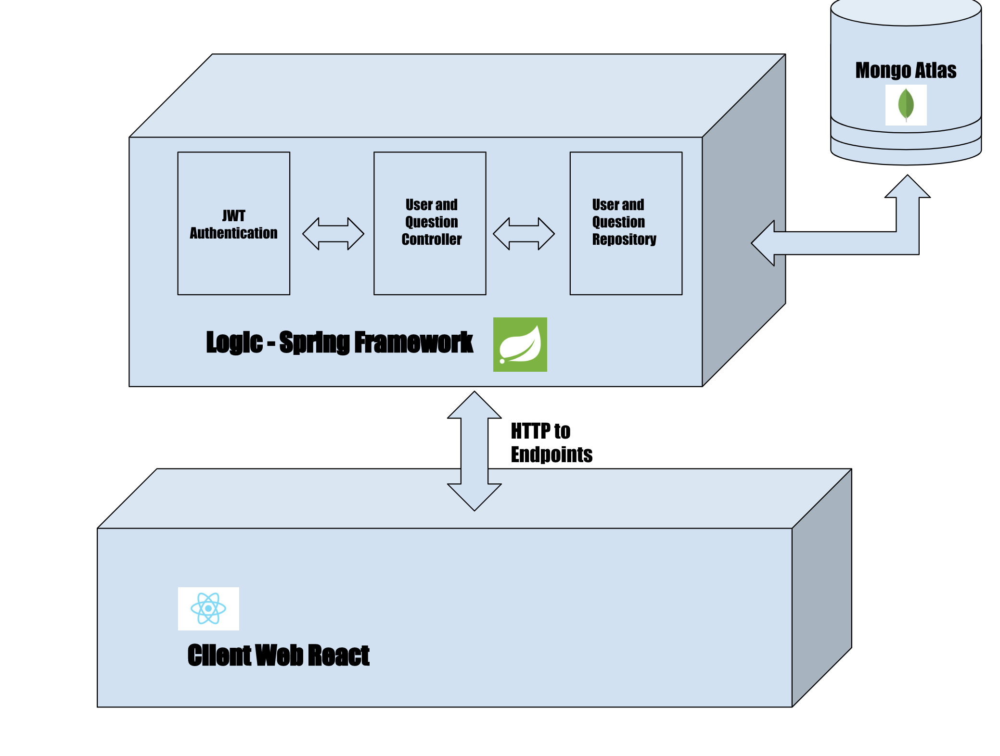
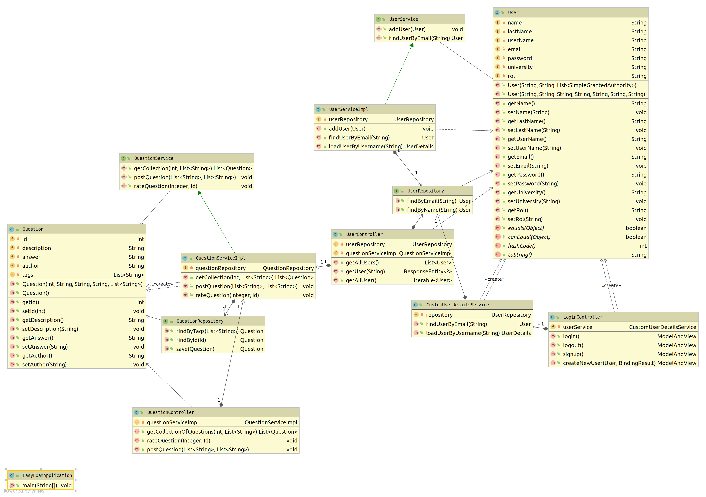
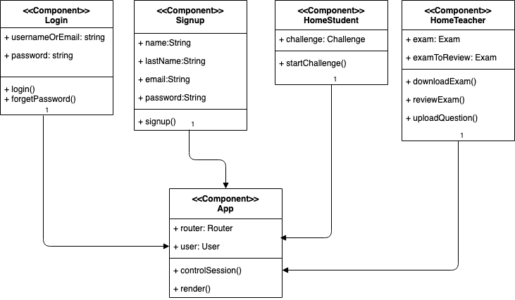
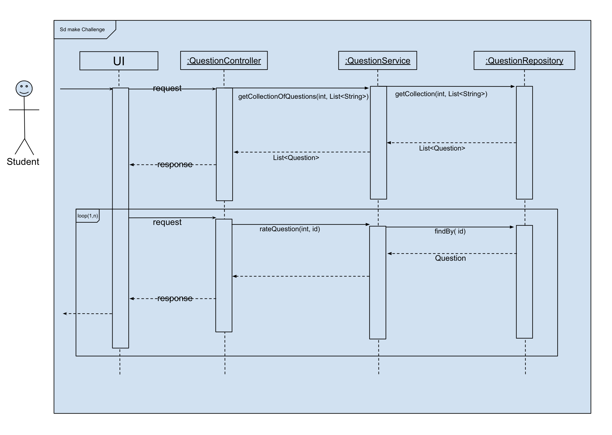
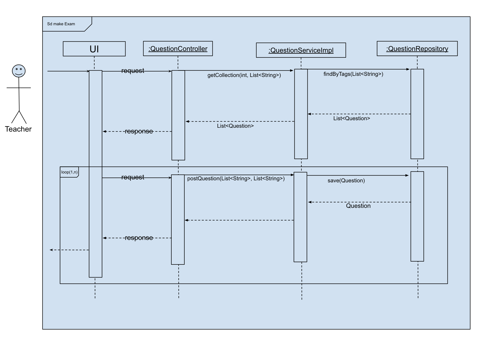

# **Developer Guide**
## Introduction
Easy exam is a plataform that helps both students and teachers streamline their problem-obtainig needs. It does this by using collaborative problem pools that randomly give out exersises bases on tags.It uses circular feedback between studying students and creating teachers, forcing a continuous feedback loop that helps to give the best possible quality for everyone involved.

## Features

### **Accounts**
* Creating account: ***register***
### **User Actions**
#### **Teacher**
* Generate Exam 
    * Choose subject
* Post exercises
* Review exercises
* Download exam/answers
### **Student**     
* Generate Challenge
    * Choose subject
* Review exercises

## Design 

### Architecture

### Class Diagram

### UI

### Logic/Controller

### Interaction between Components
#### Make Challenge

#### Make Exam

## **Glossary**
   1. Teacher: User that is only able to generate exams.
   2. Student: User that is only able to enter challenge mode.
   3. Exercises/Questions : They are an interrogative approach about some respective topic, which is shown in textual form.
   4. Test/Exam : A bunch of questions on a specific topic.
   5. Challenge Mode : A section for students where they can find exercises for them to practice.
   6. Generate Exam : A section for teachers where they can create exams.
   7. Download: Button that downloads an exam as a pdf.
   8. Log in: Enter the platform either as a teacher or student.
   9. Log out: Safely exit the platform as a teacher or student.
   10. Recover Password: Request to the platform to generate a new password to log in.
   11. Subject/Tag: Topic of any course of which questions are generated.
   12. Qualify: Grade the question from 1 to 5, being 1 not very likeable and 5, likeable question.
   13. Register: Generate credentials for logging in.
   14. Credentials: Username and password.
   15. Username : Name by which the user will identify themselves.  
   16. Password: Private string by which the user will confirm identification.
