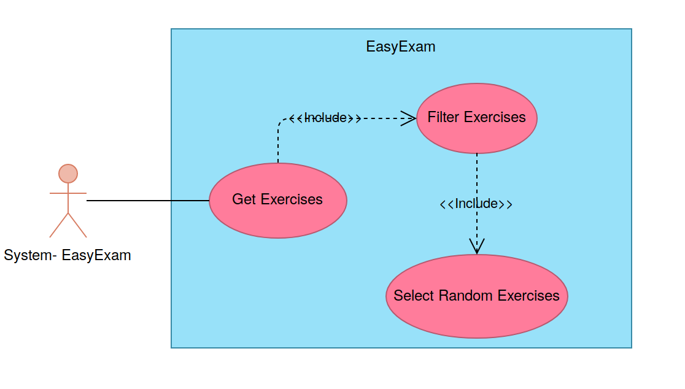
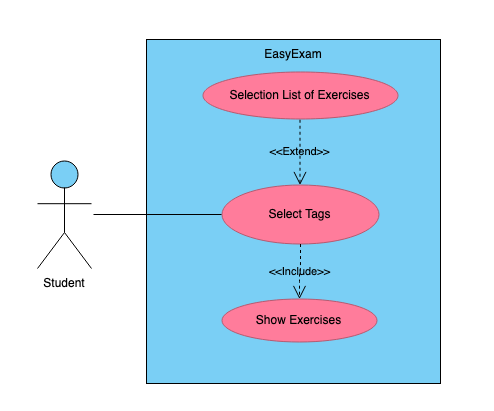
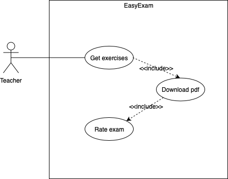

# **User Guide**

## **Target user profile, value proposition, and user stories**

### ***Target user profile***
Charles, 20, is a student of computer science at UTEC, and is currently studying from open course initiatives, youtube conferences and any books he can find. He gets frustrated every time he doesn't know the answer to a question, since most of these don't offer step-by-step solutions. In addition, he has to find new sources for each course he takes, since most of these sources are not complete.

Archibald, 45, teaches software engineering and other courses at one of the best universities. He does not have much time because he teaches many courses. Therefore, he prefers to use questions from previous exams to generate an exam for his students. He feels there must be a better way to write his exams.

### ***Value proposition***
As a student, EasyExam provides you exercises with its answers so you can practice and become a great student.

As a teacher, EasyExam provides you exercises so you save time in  designing and preparing exams. Also, EasyExam provides you the opportunity to contribute with your own exercises to the creation of next exams.

## **Requirements**

### **Functional requirements**
1. As a student, I can access challenges.
2. As a teacher, I can generate exams.
3. As a student, I can rate questions to be able to access further ones.
4. As a teacher, I can submit questions to be able to be able to generate more exams.
5. As a user, I can log in.
6. As a user, I can recover my Password.
7. As a teacher, I can check the answers for my exams.
8. As a user, I can register.
9. As a teacher, I can choose different subjects for my questions.
10. As a teacher, I can choose the number of questions for my exam.

### **Non-functional requirements**
1. As a student, I can have every functionality of the desktop version in the mobile version.
2. As a teacher, I can download my exams between 1 to 10 seconds.
3. As a user, I can have fast transitions between windows.
4. As a user, I can have a responsive page.
5. As a teacher, I can generate exams 24/7.

## **Features**

### **Accounts**
* Creating account: ***register***
### **User Actions**
#### **Teacher**
* Generate Exam 
    * Choose subject
* Post exercises
* Review exercises
* Download exam/answers
### **Student**     
* Generate Challenge
    * Choose subject
* Review exercises

## **[User Stories](https://github.com/utec-cs2901-2019-2/easy-exam-group-1-end-game/blob/master/User-Guide/USER_STORIES.md)**

## **Use Cases**

## 1. _Selection of a list of Exercices (Challenge)_

* **Software System**: EasyExam (EE)
* **Use case**: UC01 - Selection of a list of Exercices (Challenge)
* **Actor**: Student,System(EE),Database
* **Preconditions**: 
    * Student is logged in. 
    * Student select tags.
    
* **Use case**:
    1. System filters exercises ,from the Database,  by  student-asked tags.
    2. System selects randomly chosen exercises .
    3. Use case ends.

## 2. _Generate Challenge_
* **Software System**: EasyExam (EE)
* **Use case**: UC02 - Generate Challenge
* **Actor**: Student,System(EE)
* **Preconditions**: Student is logged in 
* **Guarantees**:
    * Random exercises will be shown, with no pdf-download option.
* **Use case**:
    1. Student select tags.
    2. System selects a list of exercises(UC01).
    3. System shows exercises.
    4. Student views the exercises.
    5. Use case ends.
    

## 3. _Selection of a list of Exercices (Exam)_
* **Software System**: EasyExam (EE)
* **Use case**: UC03 - Selection of a list of Exercices (Exam)
* **Actor**: Teacher,System(EE),Database
* **Preconditions**:
   * Teacher is logged in
   * The tags are selected
   * The number of questions has been chosen
* **Use case**:
    1. System selects the most rated exercises from the Database
    2. System filters the exercises by tags
    3. System selects some random exercises
    4. Use case ends.

    
## 4. _Generate Exams_
* **Software System**: EasyExam (EE)
* **Use case**: UC04 - Create Exams
* **Actor**: Teacher,System(EE)
* **Preconditions**:
   * Teacher is logged in
* **Use case**:
    1. Teacher selects topic from the selector
    2. Teacher selects the number of questions
    3. System selects a list of exercises(UC03)
    4. Teacher downloads the exam
    5. Teacher rates the exam
    6. Use case ends.

## **Glossary**
   1. Teacher: User that is only able to generate exams.
   2. Student: User that is only able to enter challenge mode.
   3. Exercises/Questions : They are an interrogative approach about some respective topic, which is shown in textual form.
   4. Test/Exam : A bunch of questions on a specific topic.
   5. Challenge Mode : A section for students where they can find exercises for them to practice.
   6. Generate Exam : A section for teachers where they can create exams.
   7. Download: Button that downloads an exam as a pdf.
   8. Log in: Enter the platform either as a teacher or student.
   9. Log out: Safely exit the platform as a teacher or student.
   10. Recover Password: Request to the platform to generate a new password to log in.
   11. Subject/Tag: Topic of any course of which questions are generated.
   12. Qualify: Grade the question from 1 to 5, being 1 not very likeable and 5, likeable question.
   13. Register: Generate credentials for logging in.
   14. Credentials: Username and password.
   15. Username : Name by which the user will identify themselves.  
   16. Password: Private string by which the user will confirm identification.

## **Survey and Interviews**

   There is two kind of surveys. The first survey was developed to students and the second survey was developed to professors. We gathered 22 surveys from students and 9 surveys from professors. Besides we made 2 interviews at UTEC. 
   The results of the data collection indicate that there is a high willingness on the part of the teachers to be able to use third-party material to be able to generate their exams. At the same time, they are willing to collaborate with giving exercises to the repository. Regarding the students, many of them answered the last question of the survey (would you be willing to practice with solved exercises online?) In a positive way to 100%. However, a high percentage of students said that not being sure that their answer is correct is one of the challenges they face when practicing problems for an exam.
   
   **Questions**:
   
1. ¿Dónde labora y que curso dicta?

2. ¿Se sentiría cómodo si cambia la manera en la que ha venido trabajando?   

3. ¿Cuáles son los principales problemas que afronta al generar un examen?

4. ¿De dónde suele recolectar las preguntas?

5. ¿Es abierto a compartir alguna pregunta de su examen a algún otro profesor?

6. ¿Qué herramientas utiliza en tu día a día?

7. ¿Qué determina la dificultad de un examen?

8. Al realizar un examen, ¿Tiene las soluciones de antemano o las realiza después? ¿Por qué?

9. ¿Utiliza plantillas para sus exámenes?

   **First Interview** : 
   
   Answer 1: Henry Gallegos , ICC
   
   Answer 2: Sí
   
   Answer 3: Encontrar un adecuado nivel de dificultad para el examen
   
   Answer 4: De algunas paginas web
   
   Answer 5: Sí
   
   Answer 6: Canvas, Hackerrank
   
   Answer 7: El análisis que implica resolver el problema
   
   Answer 8: Sí tengo las soluciones antes
   
   Answer 9: Sí
   
   **Second Interview** : 

   Answer 1: Teofilo Chambilla, Base de datos, POO 1
   
   Answer 2: Sí
   
   Answer 3:Diseñar las preguntas para los estudiantes
   
   Answer 4: Intercambia material con colegas (profesor. Heider)
   
   Answer 5: Sí
   
   Answer 6: Hackerrank, Drive
   
   Answer 7: Encontrar una solución de una forma no tan obvia
   
   Answer 8: Sí 
   
   Answer 9: Sí
   
   **Third Interview** : 

   Answer 1: Heider Sanchez, Base de datos 2, POO 1
   
   Answer 2: Sí
   
   Answer 3: Tiempo para hacerlo
   
   Answer 4: Material pasado o con otros colegas
   
   Answer 5: Sí
   
   Answer 6: Canvas, Word, Excel
   
   Answer 7: El nivel de los alumnos
   
   Answer 8: Sí, para corregir los examenes más rápido 
   
   Answer 9: Sí
   
   Links Student Survey :
   https://docs.google.com/forms/d/1xXwVFp3H4BrOxxErT0H3xJp7Dg65gsJmZnlvEMpLTOM
   
   Links Professor Survey :
   https://docs.google.com/forms/d/1rlYnMQLkwsUv3-l0O5UjqI_MbW8jMV34tQDTwbJTA5M
   
   
